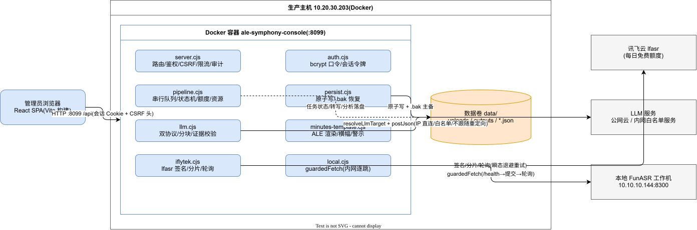
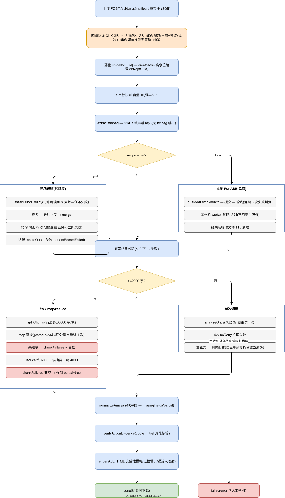

# MMBoard 总体架构设计

| 项 | 值 |
|---|---|
| 文档状态 | ✅ 成文(已按《文档库质量提升指导》核对) |
| 适用功能版本 | `7e55f94` |
| 最近核对日期 | 2026-09-23 |
| 维护责任人 | 待指定(项目方) |
| 事实依据 | server/*.cjs、deploy/deploy.cjs、diagrams/01 与 03 |
| 版本 | v1.0(as-built) |
| 日期 | 2026-09-23 |
| 基线 | `7e55f94` |
| 关联 | 《详细设计说明书》《数据设计说明》《接口设计文档》《部署手册》 |

## 1. 架构总览



> 编辑源:`../diagrams/01-系统架构与部署拓扑.drawio`(打开方式见 `../diagrams/README.md`)

单机单实例三层结构:浏览器 SPA ↔ Node/Express 单进程服务 ↔ 外部服务(LLM 云/内网、讯飞云、本地 FunASR 工作机)。无数据库,状态全部为数据目录内的 JSON 文件(原子持久化);无消息队列,任务为进程内串行队列。

```
┌──────────────┐   HTTP(会话Cookie+CSRF头)
│  React SPA   │◄──────────────────────────────►┌─────────────────────────────┐
│ (Vite 构建)  │   /api/auth /api/tasks         │ Node/Express 单进程         │
└──────────────┘   /api/settings /api/meta      │  server.cjs(HTTP/鉴权/CSRF) │
                                                │  pipeline.cjs(串行任务队列) │
                                                │  ├─ iflytek.cjs ──────► 讯飞 lfasr 云
                                                │  ├─ local.cjs ────────► 本地 FunASR 工作机
                                                │  ├─ llm.cjs ──────────► LLM(OpenAI兼容/Anthropic)
                                                │  ├─ minutes-template.cjs(ALE HTML 渲染)
                                                │  ├─ persist.cjs(JSON 原子写/恢复)
                                                │  └─ auth.cjs(登录/会话令牌)
                                                │        │
                                                │   数据目录 data/(uploads/ outputs/ *.json)
                                                └─────────────────────────────┘
                                                      Docker 容器 ale-symphony-console
                                                      数据卷挂载 data/
```

## 2. 技术栈

| 层 | 选型 | 说明 |
|---|---|---|
| 前端 | React + TypeScript + Vite + TailwindCSS + TanStack Table + i18next(zh/en) | SPA,构建产物 `dist/` 由 Express 静态托管 |
| 后端 | Node.js(生产 v22)+ Express,CommonJS 模块(`server/*.cjs`) | 单进程;任务串行队列 |
| 存储 | 数据目录内 JSON 文件 + 上传/产物文件 | 无数据库;原子写+主备 .bak |
| 转写 | ①讯飞云 lfasr(HTTP 签名+分片上传+轮询) ②本地 FunASR(HTTP 服务,工作机自转码) | 设置页切换 |
| 分析 | LLM 双协议:OpenAI 兼容 `chat/completions` / Anthropic `v1/messages` | 多模型条目,激活其一 |
| 部署 | Docker(生产 10.20.30.203:8099),`deploy/deploy.cjs` 自动化发布 | 候选容器+隔离卷快照+健康检查+自动回滚 |

## 3. 组件职责

| 组件 | 职责 | 关键约束 |
|---|---|---|
| `server/server.cjs` | 路由、会话鉴权、CSRF、限流、上传四道防线、设置管理、审计日志 | 所有非 GET 请求必须带 `X-Requested-With` |
| `server/pipeline.cjs` | 任务状态机、串行队列(容量10)、抽音轨、转写调度、额度记账、资源治理(配额/水位/媒体探测) | runId 取代机制:任何状态写入前校验,被新实例取代即静默退出 |
| `server/llm.cjs` | LLM 双协议调用、地址安全解析(IP 绑定)、分块提取(map/reduce)、输出规范化、证据校验入口 | 超时/截止/响应上限;空正文报错 |
| `server/iflytek.cjs` | 讯飞 lfasr 全链路:签名/分片上传/轮询/分类重试 | 业务码立即失败;瞬态有限重试 |
| `server/local.cjs` | 本地 FunASR 客户端;`guardedFetch` 内网逐跳安全请求 | 仅私网;≤3 跳;不跟随外网重定向 |
| `server/minutes-template.cjs` | ALE 规范 HTML 渲染、说话人渲染层映射、证据警示、完整性横幅 | 模板对任何 LLM 输出形状不崩溃 |
| `server/persist.cjs` | `writeJsonAtomic`(tmp+rename+备份)、`readJsonWithRecovery`(.bak 恢复/.corrupt 隔离/双坏抛错) | 多进程安全的临时文件名;Windows EPERM 重试 |
| `server/auth.cjs` | 首次初始化、bcrypt 口令、会话令牌签发/校验/撤销 | 首次口令一次性随机或环境注入 |
| `tools/local-asr/server.py` | FunASR 工作机服务:队列、worker 转码+识别、TTL 清理、健康检查 | 与主服务进程隔离 |
| `src/`(SPA) | 看板、上传、详情、设置、纪要查看;所有业务错误 toast 显式提示 | a11y:双层弹窗/焦点圈闭/progressbar 语义 |

## 4. 关键数据流

### 4.1 任务流水线(主流程)



> 编辑源:`../diagrams/03-端到端任务流水线.drawio`

```
上传(multipart)→ 四道防线(413/水位/配额/媒体探测)→ 落盘 uploads/{uuid}.{ext}
→ createTask(编号=高水位+1,目录键=uuid)→ 入串行队列
→ extract:ffmpeg 转 16kHz 单声道 mp3(mp3 直传;无 ffmpeg 跳过)
→ transcribe:讯飞(签名→分片上传→轮询,转写前 assertQuotaReady,成功后记账)
            或本地 FunASR(健康检查→提交→轮询)
→ analyze:≤42000 字单次调用;>42000 字 map(逐块原文)→ reduce(头 6000 原文+块摘要+尾 4000 原文)
          → 规范化(normalizeAnalysis)→ 证据校验(verifyActionEvidence)
→ render:渲染层说话人映射 → ALE HTML → outputs/{uuid}/
→ 终态 done/failed;transcript.json/analysis.json 落盘供"仅重跑分析"复用
```

### 4.2 结果可信链

mock 标识、partial/chunkFailures 横幅、行动项证据状态(`verified/unverified/invalid/none` + 分类警示)贯穿:分析产出 → 落盘 → 渲染 → 纯重渲染,警示不丢失。详见《详细设计说明书》§4。

### 4.3 设置与并发控制

settings.json 带递增 `version`;PUT/快捷切换回传 version,不匹配 409(另一窗口已保存)。LLM 内网白名单 `allowedLlmHosts` 随保存贯通到执行路径与测试接口。

## 5. 部署拓扑

| 项 | 值 |
|---|---|
| 生产主机 | 10.20.30.203(Docker) |
| 生产容器 | `ale-symphony-console`,端口 8099,数据卷挂载 `data/` |
| 发布方式 | `node deploy/deploy.cjs`:打包(不含 node_modules/data/密钥)→ 传主机 → build 候选镜像 `:cand` → 候选容器(临时端口、隔离数据卷快照)健康检查(/api/version 期望 commit + /api/auth/status)→ 通过才停旧换新 → 失败自动用旧镜像回滚 |
| 回滚 | 旧镜像保留;`DEPLOY_DRILL=1` 可演练"健康检查失败→自动回滚" |
| 本地转写工作机 | 10.10.10.144:8300(FunASR,独立于主服务;不可达不阻塞主服务) |

## 6. 外部依赖与失效边界

| 依赖 | 用途 | 失效表现(设计行为) |
|---|---|---|
| 讯飞 lfasr | 云转写 | 瞬态重试→超限明确失败;额度损坏→付费调用前拒绝;额度耗尽→任务失败并提示 |
| LLM 服务 | 纪要分析 | 空正文/超时/截断→明确失败或 partial;地址不合规→拒绝(白名单口径) |
| 本地 FunASR | 免费转写 | 不可达→任务明确失败(不影响主服务);队列满→拒绝;TTL 清理 |
| ffmpeg/ffprobe | 抽音轨/媒体探测 | 未装→跳过转码(如实提示);探测失败按无音轨拒绝 |

## 7. 设计取舍记录(Why)

| 决策 | 理由 |
|---|---|
| 无数据库,JSON 文件存储 | 单管理员单实例,数据量小;换取零运维依赖;以原子写+主备恢复保证可靠性(多实例是明确范围外) |
| 任务串行队列 | 转写/分析为重资源操作,串行简化一致性;容量 10 + 明确拒绝优于无界排队 |
| 渲染层说话人映射 | analysis 落盘保持 canonical,改名永不固化,任意次重渲染一致 |
| 分块 map/reduce 而非采样 | 采样只能提高概率,分块对"中段唯一决议不丢"提供保证;失败块强制 partial 不冒充完整 |
| 设置测试接口复用执行路径请求器 | 历史教训:测试走旁路会漏掉真实路径的安全缺陷(第四/最终复审 R05/F01 系列结论) |

## 8. 明确的非目标

多实例/分布式锁、数据库化、HTTPS/代理层治理、读屏器实机适配、横向扩容——见《需求规格说明书》§5 与《关键决策记录》。
