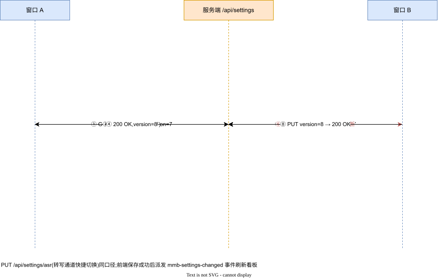

# MMBoard 接口设计文档(REST API)

| 项 | 值 |
|---|---|
| 版本 | v1.0(as-built) |
| 日期 | 2026-09-23 |
| 基线 | `7e55f94`(路由提取自 `server/server.cjs`) |
| 关联 | 《数据设计说明》(响应体字段定义) |

## 1. 全局约定

| 约定 | 说明 |
|---|---|
| 基址 | 生产 `http://10.20.30.203:8099`;前端同源 `/api/*` |
| 鉴权 | 除标注「公开」外全部需要会话 Cookie(`mt_session`);401 时前端整页重载回登录 |
| CSRF | **所有非 GET 请求必须带** `X-Requested-With: XMLHttpRequest`,否则 403 |
| 内容类型 | JSON 接口 `application/json`;上传为 `multipart/form-data` |
| 并发控制 | 设置类写接口带 `version` 回传,不匹配 → 409 |
| 限流 | `/api/settings/test`、`/api/settings/test-asr`、上传各 6 次/分/IP → 429 |
| 审计 | 登录/改密/任务创建删除/设置修改/通道测试落审计日志 |
| 错误体 | `{"error": "人话说明(含恢复指引)"}` 或测试接口 `{"ok":false,"message":"…"}` |

## 2. 认证与会话

| 方法 路径 | 鉴权 | 请求 | 响应/说明 |
|---|---|---|---|
| GET `/api/auth/status` | 公开 | — | 登录门状态;`{authenticated, username?, defaultPassword?}` |
| POST `/api/auth/login` | 公开 | `{username, password}` | 200 → `Set-Cookie: mt_session=…` + `{ok, username, defaultPassword?}`;401 口令错误;口令 bcrypt 校验,失败计数 |
| POST `/api/auth/logout` | 会话 | — | 撤销当前令牌 |
| POST `/api/auth/password` | 会话 | `{oldPassword, newPassword}` | 修改口令;旧口令错 → 400 |

首次部署初始化:无 auth.json 时自动生成一次性随机口令(仅启动日志可见一次)或读环境变量 `MMB_ADMIN_PASSWORD`;`defaultPassword:true` 提示尽快改密。

## 3. 元信息

| 方法 路径 | 鉴权 | 说明 |
|---|---|---|
| GET `/api/version` | **公开** | `{name, version, commit, builtAt, startedAt, node}`——部署健康检查与版本口径基准 |
| GET `/api/meta` | 会话 | `{ffmpeg, iflytekConfigured, llmConfigured, settingsVersion, asrProvider, localAsrOnline}`——看板通道状态与能力提示 |

## 4. 设置(模型/转写通道/白名单)

> 编辑源:`../diagrams/08-设置并发控制时序.drawio`(version 并发保护;PUT /api/settings/asr 同口径)

| 方法 路径 | 请求 | 响应/说明 |
|---|---|---|
| GET `/api/settings` | — | `{version, activeId, models, allowedLlmHosts[], asr, iflytek(appId 明文,key/secret 打码,fromFallback), fallback?}` |
| PUT `/api/settings` | `{version?, activeId, models[], asr?, iflytek?, allowedLlmHosts?}` | `{ok, version(新), activeId, count}`;409 并发冲突;400:改地址沿用打码密钥 / 白名单条目非法(host 或 host:port,≤64 条)/ 讯飞缺 apiSecret;**apiKey 含 `****` 视为未修改沿用旧值** |
| POST `/api/settings/test` | `{id}`(测已存条目)或 `{entry:{provider,baseUrl,model,apiKey}}`(表单直测,要求明文 key) | `{ok, ms, message}`;走与真实调用完全相同的安全请求器(resolveLlmTarget + postJson:IP 直连、不跟随重定向、白名单);白名单/地址不合规 → 400 含 allowedLlmHosts 提示;302 不跟随(ok:false);429 限流 |
| PUT `/api/settings/asr` | `{provider?, localUrl?, version(**必填**)` | `{ok, version(新), asr}`;缺 version 400;不匹配 409;localUrl 仅内网地址 400 |
| POST `/api/settings/test-asr` | `{localUrl}` | `{ok, message}`;guardedFetch 探测 `/health`(≤3 跳,仅内网,重定向到外网被拒);429 限流 |

## 5. 任务

### 5.1 查询

| 方法 路径 | 说明 |
|---|---|
| GET `/api/tasks` | 任务数组(新→旧),元素见《数据设计说明》§2(含 `quotaRecordFailed` 等标记) |
| GET `/api/tasks/:id` | 单任务;不存在 404 |

### 5.2 创建(上传)

`POST /api/tasks` — `multipart/form-data`,字段名 `file`(音频/视频)。处理链与失败码:

| 顺序 | 检查 | 失败码 |
|---|---|---|
| 1 | Content-Length > 2GB+64KB | 413 |
| 2 | 磁盘剩余 < 水位(默认 1GB) | 503 |
| 3 | uploads 占用+在途预留+本次 > 配额(默认 20GB) | 503 |
| 4 | (multer 落盘)媒体探测无音轨 | 400(清理孤文件) |
| 5 | 队列满(容量 10)/ 上传限流 / 建任务失败 | 503 / 429 / 503 |

成功:`201` + 任务对象,流水线异步开始。

### 5.3 重跑与说话人标注

| 方法 路径 | 请求 | 说明 |
|---|---|---|
| GET `/api/tasks/:id/rerun-preview` | — | 重跑前预览:整条重跑/仅重跑分析的可行性与影响 |
| POST `/api/tasks/:id/restart` | `{scope?: "analyze"}`(缺省整条) | 生成新 runId 重新入队;`analyze` 复用已存转写(不耗转写额度);运行中 409;队列满 503(在改写状态前拒绝,不产生永久 queued) |
| GET `/api/tasks/:id/speakers` | — | 说话人统计与 canonical 名称(供标注) |
| PUT `/api/tasks/:id/speakers` | `{map: {"0": "张三"}}` | 人工标注;运行中 409;仅渲染层映射,纪要即时重渲染 |
| GET `/api/tasks/:id/minutes` | — | 纪要 HTML(在线查看) |
| GET `/api/tasks/:id/minutes/download` | — | 纪要文件下载(附件) |
| DELETE `/api/tasks/:id` | — | 删除任务并连带清理源文件与产物;运行中 409 |

## 6. 前端调用封装约定(src/lib/*.ts)

- 统一 401 → 整页重载回登录门;`SettingsError` 把 400/409 的服务端 `error/message` 直接带入 toast。
- 保存设置成功后派发 `mmb-settings-changed` 事件,看板刷新 `/api/meta`。

## 7. 变更约束

新增/修改接口必须:① 更新本文档;② 补运行期断言(verify 或回归);③ 保持 CSRF/鉴权中间件覆盖;④ 破坏性变更递进版本口径并记录《版本与发布管理》。
