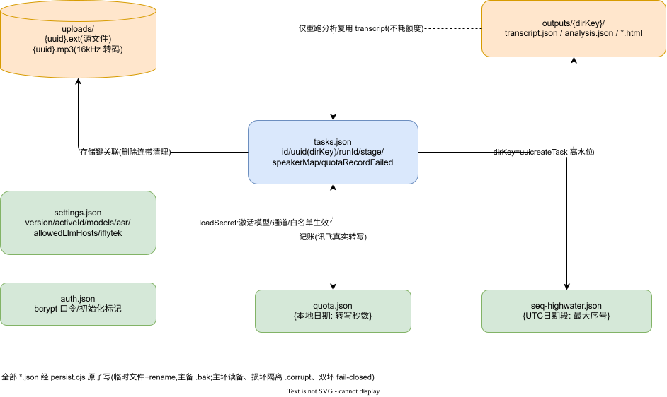

# MMBoard 数据设计说明

| 项 | 值 |
|---|---|
| 版本 | v1.0(as-built) |
| 日期 | 2026-09-23 |
| 基线 | `7e55f94` |
| 关联 | 《详细设计说明书》§5/§6、《运维手册》(备份恢复) |

## 1. 存储总览



> 编辑源:`../diagrams/11-数据文件关系图.drawio`

无数据库。全部持久状态位于**数据目录**(生产为容器数据卷挂载的 `data/`;默认 `server/data`,可用 `MMB_DATA_DIR` 覆盖,测试全部隔离到临时目录):

```
data/
├── auth.json             认证配置(口令哈希、初始化标记)
├── settings.json         模型条目/激活模型/转写通道/讯飞参数/白名单/版本号
├── tasks.json            全部任务记录(数组)
├── quota.json(.bak)      讯飞每日转写秒数记账
├── seq-highwater.json    编号高水位 {"YYYYMMDD": 最大序号}
├── audit 相关日志文件      关键操作审计(追加写)
├── uploads/              上传源文件与转码中间产物,文件名为 uuid 存储键
└── outputs/{dirKey}/     任务产物:minutes HTML、transcript.json、analysis.json
                          (dirKey = uuid;存量旧任务回退 MT-编号,向后兼容)
```

所有 JSON 状态文件统一经 `persist.cjs` 原子写(临时文件 + `.bak` 主备 + rename);读取带恢复(主坏读备、损坏隔离 `.corrupt`、双坏抛错)。**任何工具不得绕过该模块手写这些文件。**

## 2. tasks.json(任务记录)

数组,新任务 unshift 在前。单条关键字段:

| 字段 | 类型 | 说明 |
|---|---|---|
| `id` | string | 展示编号 `MT-YYYYMMDD-NNN`(日期段为 UTC 口径);由高水位保证永不复用 |
| `uuid` / `dirKey` | string(uuid) | 产物目录键与文件存储键前缀;旧数据可能缺失(回退 id) |
| `runId` | string(uuid) | 当前执行实例标识;取代机制依据 |
| `title` / `originalFileName` / `fileName` | string | 会议名(可改)、原始文件名(展示)、存储文件名 |
| `sizeBytes` | number | 源文件大小 |
| `stage` | enum | queued/extracting/transcribing/analyzing/rendering/done/failed |
| `steps[]` | Step[] | 五步明细:key/label/status/startedAt/finishedAt/note |
| `transcriptChars` | number | 转写字数 |
| `audioSeconds` | number | 音频时长(秒,转写后探测) |
| `transcriptionMode` | enum | iflytek / local / **mock**(mock 纪要全程标识) |
| `speakerMap` | object | 人工标注 `{"说话人N": "昵称"}`;仅渲染层映射,不回写转写文本 |
| `minutesFile` | string | 产物相对路径(存在即可"仅重跑分析"/下载) |
| `error` | string | 失败原因(人话,含恢复指引) |
| `quotaRecordFailed` | boolean | 额度记账失败标记(看板显示「额度未记账」) |
| `hasTranscript` / `hasSource` | boolean | 转写/源文件是否在(决定重跑能力) |
| `createdAt` / `updatedAt` | ISO | 时间戳 |

## 3. settings.json(设置)

| 字段 | 说明 |
|---|---|
| `version` | 递增整数;并发编辑保护(PUT 回传不匹配 → 409) |
| `activeId` / `models[]` | LLM 模型条目(id/name/provider(anthropic\|openai)/baseUrl/model/apiKey)与激活项;`apiKey` 明文存储于服务端,接口回显打码 |
| `allowedLlmHosts[]` | LLM 内网精确白名单(host 或 host:port);贯通保存/测试/执行;旧布尔 `allowPrivateLlmHosts` 加载时自动迁移并删除 |
| `asr` | `{provider: "iflytek"\|"local", localUrl}` 转写通道 |
| `iflytek` | `{appId, apiKey, apiSecret, demo}`;key/secret 接口回显打码,提交打码值=不修改 |
| `asrDailyQuotaSeconds` | 每日免费转写秒数覆盖(默认 2h) |

回退链:未配置激活模型时回退 `server/meeting.secret.json` 的 `llm`(兼容既有部署);讯飞参数同构回退。

## 4. 认证 auth.json

`{ username, passwordHash(bcrypt), saltRounds, initializedAt, defaultPassword? }`。首次启动自动生成一次性随机口令(仅启动日志打印一次)或读 `MMB_ADMIN_PASSWORD`;`defaultPassword` 标记提醒改密。会话令牌为服务端签发串(`mt_session` Cookie),内存/文件级撤销表支持登出失效。

## 5. quota.json 与 seq-highwater.json

```jsonc
// quota.json   讯飞真实转写记账(本地转写与 mock 不记);键为本地自然日
{ "2026-09-23": 1873.5 }

// seq-highwater.json   编号高水位;键为 UTC 日期段(与任务编号一致)
{ "20260922": 7, "20260923": 2 }
```

两文件均为 fail-closed 语义:主备双坏时分别**拒绝付费转写**(预检)与**拒绝创建任务**,错误信息含人工修复指引——不允许静默回零(额度会被重置放大、编号可能复用)。

## 6. 产物文件(outputs/{dirKey}/)

| 文件 | 内容 |
|---|---|
| `*.html` | ALE 规范纪要(文件名含标题 slug、v0.1 版本戳、日期);内嵌完整性横幅与证据警示 |
| `transcript.json` | `{ text, segments[{start,end,text,speaker}], hasSpeakers, speakerMap }`——"仅重跑分析"复用,不耗转写额度 |
| `analysis.json` | 规范化分析结果 + `quoteState/trefState` + `partial/chunkFailures/samplingTruncated` 等完整性字段;纯重渲染直接复用 |

segments 时间单位为毫秒;`speaker` 为 canonical(`"0"`/`"1"`…),渲染时才应用 speakerMap。

## 7. 上传目录 uploads/

- 存储键:`{uuid}.{ext}`(与 originalname 解耦,同名上传隔离);转码产物 `{uuid}.mp3`(16kHz 单声道)。
- 删除任务时连带删除源文件与产物目录;上传被四道防线拒绝时不落盘、落盘后被拒(无音轨/队满/限流/建任务失败)即清理,不留孤文件。
- 容量:总配额默认 20GB(`MMB_UPLOADS_QUOTA_BYTES`),配额判断含在途预留与本次大小;磁盘水位 1GB。

## 8. 数据生命周期

| 数据 | 保留策略 |
|---|---|
| 任务与产物 | 永久保留,直至管理员删除(删除即连带清理,不可恢复) |
| 转码中间产物 | 与任务同生命周期(随任务删除清理) |
| 本地 FunASR 工作机临时文件 | 工作机侧 TTL 清理(`TASK_TTL_SEC`) |
| 审计日志 | 追加保留;轮转策略未自动化(见《运维手册》巡检项) |
| `.corrupt` 隔离文件 | 保留供人工分析,确认后手动删除 |

## 9. 演进约束

新增状态文件必须:① 走 `persist.cjs` 原子写与恢复;② 在《运维手册》备份清单登记;③ 双坏 fail-closed 或有明确降级语义;④ 本文档同步更新 schema。
