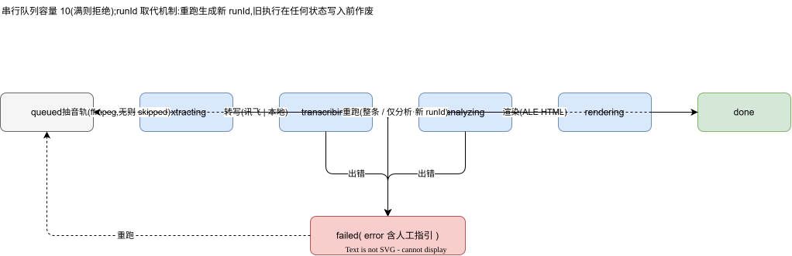
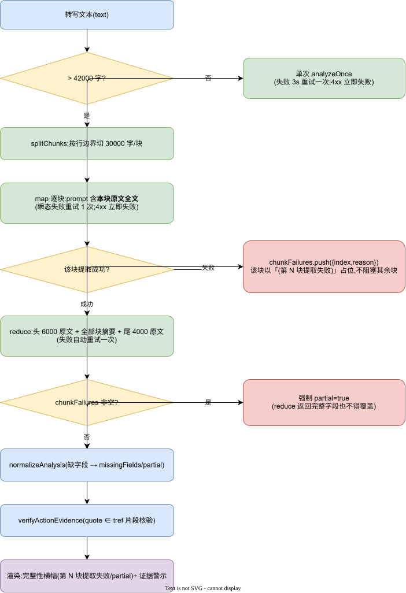
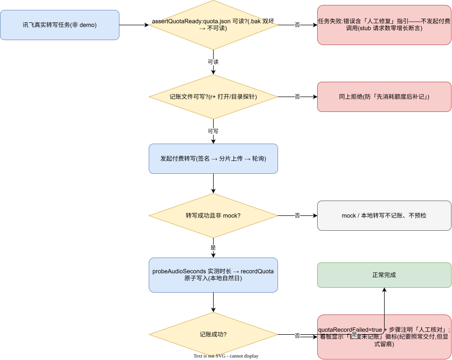
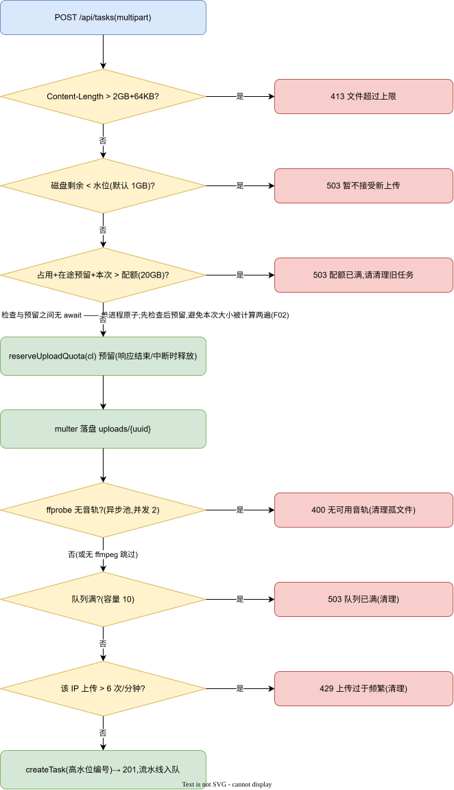
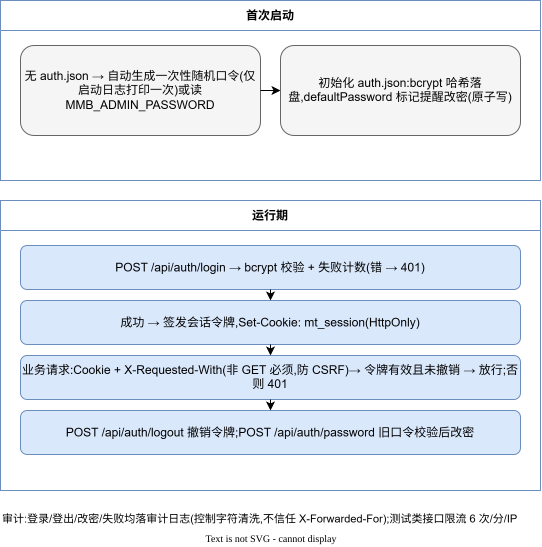

# MMBoard 详细设计说明书

| 项 | 值 |
|---|---|
| 版本 | v1.0(as-built) |
| 日期 | 2026-09-23 |
| 基线 | `7e55f94` |
| 关联 | 《总体架构设计》《数据设计说明》《接口设计文档》 |

## 1. 任务状态机与执行模型



> 编辑源:`../diagrams/02-任务状态机.drawio`

### 1.1 状态与步骤

```
queued → extracting → transcribing → analyzing → rendering → done
   └──────────────────────────────────────────────► failed(任意阶段出错)
```

任务记录含 `steps[]`(import/extract/transcribe/analyze/render 五步),每步 `status: pending|running|done|skipped|failed` + `note`。`skipped` 用于"无 ffmpeg 跳过转码"等如实降级。

### 1.2 串行队列与 runId 取代机制

- `enqueuePipeline` 入队;队列容量 `QUEUE_CAPACITY=10`,满则同步抛错(调用方转 503),在写任何状态/文件引用**之前**拒绝。
- 单 worker 顺序执行;每次执行携带 `runId`。
- **取代机制**:restart 会为任务生成新 runId 并重新入队;旧实例在每次状态写入(`updateTask/setStep`)前校验 `task.runId === runId`,不一致即抛 `RunSupersededError` 静默退出——保证"重启分析"后旧执行绝不覆盖新状态、不写产物、不继续调用 LLM。
- 长转写/长分析返回后另有 `checkRunAlive` 二次校验,避免"执行中任务被取代但仍落盘"。

### 1.3 编号与目录隔离(R01/R02)

- 展示编号 `MT-YYYYMMDD-NNN`:日期段取 **UTC**(与 `toISOString` 一致),序号取持久化高水位 `seq-highwater.json` 与现存任务、残留目录的 max+1——删除当天最新任务甚至重启后,编号永不复用。
- 产物目录键 `dirKey = uuid`(旧数据回退编号,向后兼容);上传文件存储键 = uuid 原名扩展,originalname 另存为展示名——同名上传互相隔离。

## 2. 转写双通道设计

### 2.1 通道选择

`settings.asr.provider = "iflytek" | "local"`;`loadSecret` 合成生效配置(settings 优先,回退 meeting.secret.json)。切换仅对新任务生效,看板经 `/api/meta` 展示当前通道与本地服务在线状态。

### 2.2 讯飞 lfasr 通道(server/iflytek.cjs)

- 鉴权:`signa = HMAC-SHA1(apiSecret, MD5(appId+ts))`。
- 流程:`/prepare` → 分片上传(CHUNK 10MB)→ `/merge` → 轮询结果。
- **分类重试(R17)**:网络异常/HTTP 5xx = 瞬态,重试上限 `IFLYTEK_POLL_RETRY_MAX`(默认 5),指数退避 `min(round(backoff×2×(0.9+rand×0.2)), 60000)`,初始 5s;业务错误码(如 26601)与 4xx = 确定性错误立即失败;单请求超时 30s;轮询间隔 `IFLYTEK_POLL_MS`(默认 5000,测试可注入);总轮询截止默认 30 分钟。每次轮询带 `poll #n` 日志。
- mock 口径:仅演示模式(`cfg.demo` 或 `MMB_DEMO=1`)返回确定性示例文本,且 `mock:true` 随任务入档。

### 2.3 本地 FunASR 通道(server/local.cjs + tools/local-asr/server.py)

- 工作机服务:独立进程,队列+worker(转码在 worker 线程,不阻塞服务),TTL 清理(`TASK_TTL_SEC`),容量/大小上限可配;`/health`、`POST /tasks`、`GET /tasks/:id`。
- 客户端:`guardedFetch` 全链路(健康→提交→轮询):`redirect:"manual"` 逐跳校验——每跳必须满足私网地址正则且 DNS 解析为私网 IP,连接绑定该 IP(Host 头保留),最多 3 跳;302 到外网直接拒绝。
- 单次轮询失败有限容错(连续 3 次才判失败);上传大文件宽限 10 分钟。

## 3. LLM 分析设计(server/llm.cjs)

### 3.1 地址安全(R05)

`resolveLlmTarget(url, {allowedHosts})`:
1. 仅 http/https;主机名含 `metadata` 无条件拒绝;
2. 精确白名单 `hostAllowed(hostname, port, entries)`:条目 `host` 匹配任意端口,`host:port` 精确匹配;
3. DNS 解析一次(all 结果),任一地址为 169.254.169.254 无条件拒绝;
4. 解析到私网/保留地址且未命中白名单 → 拒绝并提示加入 `allowedLlmHosts`;
5. 返回绑定 IP 的连接地址(**保留原 path/query**)、原始 Host、SNI 主机名——校验与连接同一 IP,无二次解析窗口(rebinding 关闭)。

`postJson`:原生 http/https 请求(不跟随重定向),空闲超时(默认 20 分钟,可传 15s 等短值)、总截止 25 分钟、响应体上限 10MB;`connectIp/serverName/hostHeader` 支持直连解析 IP。

### 3.2 双协议

OpenAI 兼容:`POST {base}/chat/completions`,Bearer 鉴权;Anthropic:`POST {base}/v1/messages`,`x-api-key` + `anthropic-version`。4xx 置 `noRetry`(确定性错误不重试);空正文明确报错(防止思考预算耗尽被当成功)。

### 3.3 分块提取(>42000 字,R13/F01)



> 编辑源:`../diagrams/05-LLM分块与完整性保障.drawio`

```
splitChunks(text, 30000)        按行边界切(不撕断句子),每块 ≤30000 字
mapChunkWithRetry               每块:prompt 含 <本块原文> 全文与字数,
                                要求只输出 JSON{decisions,actions,notes};
                                瞬态失败重试一次(与 analyze 同策略,noRetry 除外)
analyzeChunked                  逐块 map → 失败块记入 chunkFailures[{index,reason}] 并以
                                「(第 N 块提取失败)」占位,不阻塞其余块
→ reduce 输入 = 头 6000 字原文 + [块摘要拼接] + 尾 4000 字原文,
  明示"必须纳入纪要对应章节,不得遗漏任何决议与行动项";失败自动重试一次
→ 若 chunkFailures 非空:强制 result.partial = true,挂载 chunkFailures
  (reduce 返回完整字段也不得覆盖——F01 裁定)
```

### 3.4 输出规范化与缺失语义(R14)

`normalizeAnalysis`:字段类型纠正、缺失补空,同时计算 `missingFields`(title/summary/topics/decisions/actions 缺失者)——模板对缺字段显示"未生成",不显示为确认的"无";`partial = JSON 截断 || stopReason 异常`。

### 3.5 行动项证据校验(R15)


> 编辑源:`../diagrams/09-行动项证据校验流程.drawio`

`verifyActionEvidence(analysis, transcript, segments)`(分析完成后调用,状态随 analysis.json 持久化):
- 解析 `tref`(mm:ss-mm:ss):格式非法或 `from>=to` → `invalid`;超出音频末段结束时间 → `unverified`;
- 取与 [from,to) 重叠的 segments,**仅在这些片段文本中**核验 quote(去空白匹配);
- quote 有值无 tref → 全文回退核验;
- `quoteState/trefState ∈ verified|unverified|invalid|none`;渲染层 `evidenceBadge` 按类型显示警示(跨范围引用提示最具体:「所附原文未落在所附时间范围内」)。

## 4. 结果可信呈现(R06/R13/R14/R15)

模板 `noticeBannerHtml` 生成 `role="note"` 横幅,标签包括:演示模拟数据(mock 转写/分析)、采样覆盖、partial 截断/缺字段、`第 N 块提取失败,纪要可能缺失,建议重跑分析`、缺失章节清单。横幅由**结构化字段驱动**,不依赖模型是否保留文字提示;字段随 analysis.json 持久化,改名纯重渲染后仍在。

## 5. 额度记账与高水位(R09/R22/R02)

### 5.1 额度



> 编辑源:`../diagrams/10-额度记账与fail-closed.drawio`

- 记账文件 `quota.json`:`{"YYYY-MM-DD": 秒}`,日期为**本地自然日**(与讯飞控制台口径对齐);每日免费额度默认 2 小时,`asrDailyQuotaSeconds` 可覆盖。
- **付费调用前** `assertQuotaReady()`:主备可读(readQuotaMap,双坏抛明确错误)+ 可写性探测(r+ 打开/目录探针);失败则任务在 transcribe 前失败,错误含「人工修复」指引——绝不"先消耗额度再补记"。
- **调用后** `recordQuotaAfterTranscribe`:ffprobe 实测时长→记账;任何失败→任务 `quotaRecordFailed=true` + 步骤注明「⚠额度记账失败——请人工核对后补记」,看板显示徽标。仅讯飞真实通道记账;本地转写与 mock 不记。

### 5.2 序号高水位

`seq-highwater.json`:`{"YYYYMMDD": 当日已分配最大序号}`;`createTask` 取 max(高水位, 现存任务, outputs 残留目录)+1 后原子写回。主备双坏 → 拒绝创建新任务(防编号复用),明确报错。

## 6. 原子持久化与恢复(R09)

`persist.cjs`:
- `writeJsonAtomic(file, obj)`:写 `${file}.${pid}.${rand}.tmp` → 复制旧文件为 `.bak` → `rename` 覆盖;临时名含 pid+随机(多进程安全);rename 遇 Windows EPERM/EACCES 瞬态锁自动重试(6 次递增)。
- `readJsonWithRecovery(file)`:主文件解析失败 → 读 `.bak` 恢复并把损坏副本隔离为 `.corrupt`;主备皆坏 → 抛明确错误(**绝不静默回零/清空**);ENOENT 原样抛出由调用方初始化。
- 适用:tasks/settings/auth/quota/seq-highwater/analysis.json/transcript.json 全部状态文件。

## 7. 上传四道防线与资源边界(R18)



> 编辑源:`../diagrams/04-上传四道防线.drawio`

顺序(multer 落盘**之前**,不消耗磁盘带宽):

1. `Content-Length > 2GB+64KB` → 413;
2. 磁盘水位 `statfs` < 1GB(`MMB_MIN_FREE_BYTES`)→ 503;
3. `quotaExceeded(cl)` = uploads 现存占用 + **在途预留** + 本次 cl > 20GB(`MMB_UPLOADS_QUOTA_BYTES`)→ 503;
4. 通过后 `reserveUploadQuota(cl)` 进入进程内预留账本(响应 finish/close 释放)——检查与预留间无 await,单进程原子;并发上传各自预留,不共享旧缓存值共同越界;multer 完成即失效占用缓存,下次检查重新求和。
5. 落盘后媒体探测:`probeHasMediaStream`(ffprobe 异步 worker 池,并发 2、单次 5s)无音轨 → 400 并清理孤文件;无 ffmpeg 环境跳过(如实提示)。
6. 队列满/上传限流(6 次/分/IP)/建任务失败 → 清理本次落盘文件。

## 8. 安全设计(R03/R04/R05/R12)



> 编辑源:`../diagrams/07-认证与会话安全流程.drawio`

| 机制 | 设计 |
|---|---|
| 会话 | bcrypt 口令;`mt_session` Cookie + 服务端令牌(可撤销);首次初始化一次性随机口令(仅日志可见一次)或 `MMB_ADMIN_PASSWORD` 注入 |
| CSRF | 所有非 GET 必须带 `X-Requested-With: XMLHttpRequest`;前端统一封装 |
| 限流 | 进程内滑动窗口:测试接口与上传各 6 次/分/IP |
| 注入 | 所有用户内容(说话人名/文件名/转写文本)在 HTML/属性/图表数据中统一转义;图表 tooltip 用预编码 `speakerHtml` |
| SSRF | 见 §3.1;设置测试接口与执行路径共用 `resolveLlmTarget+postJson`/`guardedFetch`(无旁路) |
| 审计 | 登录/登出/改密/任务创建删除/设置修改/通道测试落审计日志;控制字符清洗;不信任 X-Forwarded-For |
| 密钥 | 不入 Git/镜像/部署包;设置回显打码(`sk-ab****wxyz`),改地址必须重输;仓库扫描门禁 `scan:secrets` |

## 9. 前端关键设计(src/)

- `src/lib/meeting.ts` / `settings.ts`:API 封装,统一 401 处理(整页重载回登录)、业务错误透传(400/409 message 直接 toast)。
- 设置并发保护:GET 拿 version,保存回传;409 提示刷新;保存成功派发 `mmb-settings-changed` 事件让看板刷新通道状态。
- 看板:任务表(编号/会议名/阶段/进度/字数/时间/操作),移动端卡片式;进度条 `role=progressbar`;详情弹窗双层 inert/焦点圈闭;表格容器内局部滚动,根元素禁横向溢出。
- 徽标:任务 `quotaRecordFailed` 显示「额度未记账」。

## 10. 已知限制(如实)

单实例(无跨进程锁);无 HTTPS/代理层治理(内网部署既定决策);无监控告警接入(人工巡检,见《运维手册》);`./fonts/noto.css` 构建期提示运行时解析(历史遗留,不影响构建产物)。
