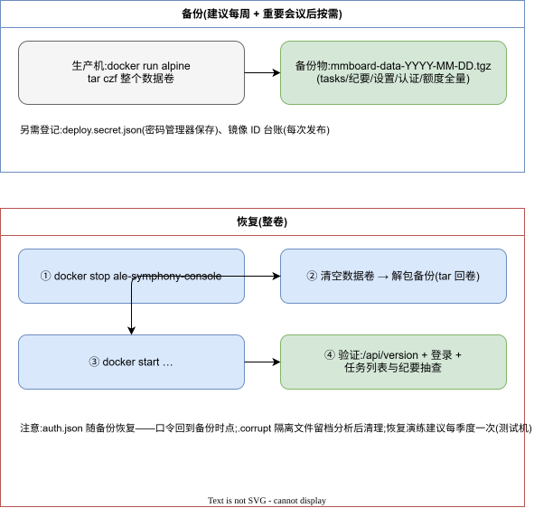

# MMBoard 运维手册

| 项 | 值 |
|---|---|
| 文档状态 | ✅ 成文(已按《文档库质量提升指导》核对) |
| 适用功能版本 | `7e55f94` |
| 最近核对日期 | 2026-09-23 |
| 维护责任人 | 待指定(项目方) |
| 事实依据 | 生产环境实测、deploy/deploy.cjs 数据卷定义 |
| 版本 | v1.0(as-built) |
| 日期 | 2026-09-23 |
| 基线 | `7e55f94` |
| 关联 | 《应急预案与故障处理》《数据设计说明》《部署手册》 |

## 1. 日常巡检(建议每周一次;系统暂无自动监控告警,以人工巡检为主——如实登记的限制)

| 检查项 | 方法 | 异常处置 |
|---|---|---|
| 服务存活 | `curl -s http://10.20.30.203:8099/api/version` 返回 JSON | 容器重启:`docker restart ale-symphony-console`;反复退出看日志 |
| 磁盘水位 | `df -h`(数据卷所在分区);系统内水位 1GB 自动拒新上传 | 清理旧任务(看板删除,连带清产物与源文件);或扩容 |
| uploads 配额用量 | 看板任务列表估算;或 `du -sh` 数据卷 uploads | 同上;配额默认 20GB,触顶自动 503 |
| 任务积压 | 看板:queued/transcribing 长时间不变的任务 | 见《应急预案》§3 |
| 额度用量 | 看 `data/quota.json` 当日秒数 vs 免费额度(默认 2h/日,`asrDailyQuotaSeconds` 可查) | 超额日任务会因讯飞侧拒绝而明确失败,属预期 |
| `quotaRecordFailed` 任务 | 看板「额度未记账」徽标 | 按《应急预案》§2 人工补记 |
| 容器日志 | `docker logs --tail 200 ale-symphony-console` | 关注 `[llm]`/`[persist]`/额度相关报错 |
| 备份有效性 | 抽查备份文件可解析(JSON) | 重做备份 |

## 2. 备份与恢复



> 编辑源:`../diagrams/13-备份与恢复流程.drawio`

### 2.1 备份对象与建议频率

| 对象 | 内容 | 频率建议 |
|---|---|---|
| 数据卷 `data/` 全量 | tasks/settings/auth/quota/高水位/uploads/outputs | **每周全量** + 每次重要会议后按需 |
| 部署凭据 deploy.secret.json | SSH 账号 | 变更时(密码管理器保存,勿明文网盘) |
| 镜像 ID 台账 | 当前与回滚镜像 | 每次发布(见《版本与发布管理》) |

### 2.2 备份方法(生产机)

```bash
docker run --rm -v <数据卷>:/data -v <备份目录>:/backup alpine \
  tar czf /backup/mmboard-data-$(date +%F).tgz -C /data .
```

### 2.3 恢复

**前提**:恢复对象为测试机或授权停机窗口;已确认备份文件可解析(`tar -tzf` 能列出内容)。

1. 停容器:`docker stop ale-symphony-console`;
2. 清空数据卷内容后解包备份(tar 回卷);
3. `docker start ale-symphony-console`;
4. **验证**(独立检查,不以命令退出码为准):`/api/version` 返回正常 JSON;管理员可登录;任务列表条数与备份时点一致;抽一份纪要可打开。

**失败处理**:容器起不来 → `docker logs` 看启动错误;登录失败 → 记住口令回到了**备份时点**(auth.json 一并恢复);个别 JSON 损坏 → 有 `.bak` 时系统自愈,整卷恢复无需 `.bak`;仍异常 → 按《应急预案与故障处理》§4 升级处理。

> 注意:auth.json 一并恢复——备份时点的口令随之恢复,如其间改过密需用备份时点口令登录。

## 3. 任务运维

| 场景 | 操作 |
|---|---|
| 任务卡在 queued/某一阶段 | 看详情步骤 note 定位;若属外部服务故障按《应急预案》;确认不可恢复后删除任务重传 |
| 误删恢复 | **不支持**(删除连带清理源文件与产物);只能依靠备份 |
| 只重跑分析 | 详情 → 重跑(仅分析):不耗转写额度;转写文本在 outputs/{dirKey}/transcript.json |
| 改说话人名 | 详情 → 说话人标注;改名只影响渲染,可任意次修改;历史纪要即时生效 |
| 大批量清理释放空间 | 看板按时间排序删除最旧任务(连带清理);删除不可逆,重要纪要先下载 |

## 4. 监控建议(未接入,转迭代)

当前无监控告警。如需接入,最小方案:对 `/api/version` 做存活探针(1 分钟)+ 磁盘用量阈值告警(80%)+ `docker logs` 关键字(`失败|ERROR`)采集。接入后更新本手册。

## 5. 安全运维

- 生产主机仅内网可达;管理面即应用本身(单管理员);
- 定期巡检审计日志(登录失败、异常时段操作);
- **凭据轮换**《配置与密钥管理》§6(移交前待办);
- 升级 Node 基础镜像随发布进行(Dockerfile 基座更新),不做生产机上原地升级。

## 6. 容量与性能口径

- 单实例串行任务:同一时刻一个任务在转写/分析,其余排队(≤10);
- 实测参考:真实 FunASR 健康响应 ~7ms;40 秒音频转写 ~4s;30 分钟会议端到端分钟级(详见《性能与容量测试报告》骨架,perf-baseline.json 为准);
- LLM 分析耗时与会议长度、模型服务能力相关;超长会议(>42000 字)自动分块,时长近似线性增加。
