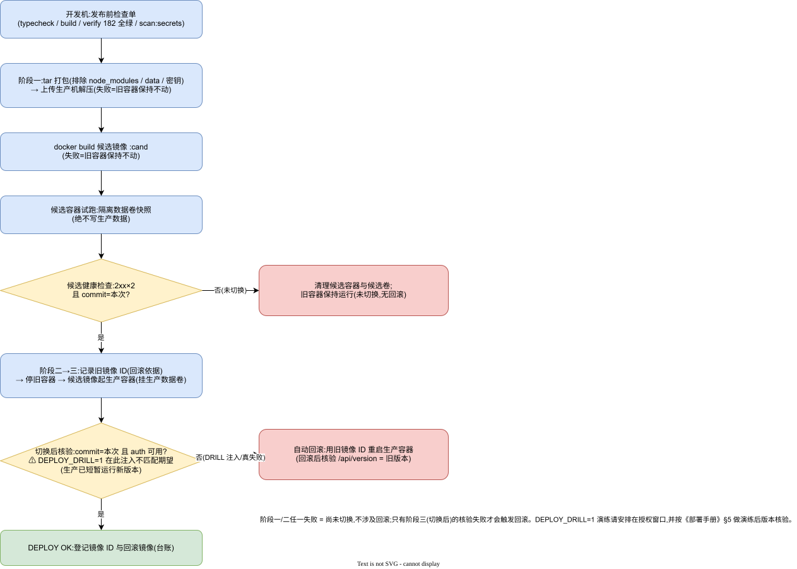

# MMBoard 部署手册

| 项 | 值 |
|---|---|
| 文档状态 | ✅ 成文(已按《文档库质量提升指导》核对) |
| 适用功能版本 | `7e55f94` |
| 最近核对日期 | 2026-09-23 |
| 维护责任人 | 待指定(项目方) |
| 事实依据 | deploy/deploy.cjs 逐行实现、生产发布日志(镜像 ID/回滚记录) |
| 版本 | v1.0(as-built) |
| 日期 | 2026-09-23 |
| 基线 | `7e55f94` |
| 关联 | 《配置与密钥管理》《应急预案与故障处理》《版本与发布管理》 |

## 1. 部署形态

| 项 | 值 |
|---|---|
| 生产主机 | 10.20.30.203(Docker;SSH 账号见 deploy.secret.json,不入库) |
| 容器 | `ale-symphony-console`;端口 8099;数据卷挂载容器内 `data/`;restart 常驻 |
| 镜像 | 每次发布由 deploy.cjs 现场构建(候选 `:cand` → 切换后为生产镜像);镜像 ID 不可变,回滚按 ID |
| 构建基座 | `deploy/Dockerfile`(Node 22;COPY 清单见文件,新增服务端文件必须同步加入) |

## 2. 一次发布(deploy.cjs 自动执行的全流程)



> 编辑源:`../diagrams/06-发布与回滚流程.drawio`(打开方式见 `../diagrams/README.md`)

```bash
node deploy/deploy.cjs          # 在开发机仓库根目录执行(DEPLOY_HOST/DEPLOY_PORT 可覆盖目标)
```

脚本内部按四个**失败语义不同**的阶段执行:

### 阶段一:上传与构建(失败 = 旧容器保持不动,不发生"回滚")

| 步骤 | 动作 | 失败时的行为 |
|---|---|---|
| 1 打包 | tar 打包仓库(dist/public/assets/vendor/server 代码与 Dockerfile;**不含** meeting.secret.json、data、deploy 目录) | 本地即失败,未连接生产 |
| 2 上传解压 | SFTP 上传 → 生产机解压到远程构建目录 | 解压失败退出,**旧容器保持不动** |
| 3 构建候选镜像 | `docker build -t <镜像:commit-cand>`(直接看退出码) | 构建失败退出,**旧容器保持不动** |

### 阶段二:候选容器验证(失败 = 删除候选,旧容器保持不动)

| 步骤 | 动作 | 失败时的行为 |
|---|---|---|
| 4 隔离数据卷 | `docker volume create mmboard-cand-data` + alpine `cp -a` 从生产卷复制快照 | 快照失败退出,旧容器不动 |
| 5 候选试跑 | 临时端口起候选容器(挂**候选卷**,不触生产数据),等待 4 秒 | 启动失败退出,旧容器不动 |
| 6 健康检查 | `curl -f /api/version`(2xx 且 commit=本次)+ `/api/auth/status`(2xx) | **删除候选容器与候选卷**,退出;旧容器保持不动 |

> 阶段一、二的任何失败,生产服务始终运行旧版本——这不是"回滚",是尚未切换。

### 阶段三:切换(此步起,失败才会触发"用旧镜像回滚")

| 步骤 | 动作 | 失败时的行为 |
|---|---|---|
| 7 记录回滚依据 | `docker inspect` 取旧容器的**不可变镜像 ID** | — |
| 8 停旧起新 | 停删旧容器 → 用候选镜像按生产参数(端口 8099 + 生产数据卷 + `--restart unless-stopped`)起正式容器 | 启动失败 → **立即用旧镜像 ID 重启生产容器** |
| 9 切换后核验 | 等待 5 秒 → `curl /api/version`,期望 `commit = 本次发布`(**`DEPLOY_DRILL=1` 时故意注入不匹配期望,见 §5**) | 核验失败 → **自动用旧镜像 ID 重启生产容器**(此时生产已短暂运行新版本) |

### 阶段四:收尾

成功输出 `DEPLOY OK → http://10.20.30.203:8099/ (commit <本次>)`;**无论成败,把本次镜像 ID 与回滚镜像 ID 记入《版本与发布管理》台账**。

## 3. 发布前检查单

- [ ] `npm run typecheck`、`npm run build` 通过
- [ ] `node scripts/verify_batch_a.cjs` 全绿(182)
- [ ] `npm run scan:secrets` 通过
- [ ] 新增服务端文件已加入 `deploy/Dockerfile` COPY 清单
- [ ] 新增环境变量已登记《配置与密钥管理》§2 并在部署侧注入
- [ ] 涉及数据结构变更:确认旧数据兼容(启动不迁移即失败的设计不允许);文档同步
- [ ] 本次发布要点与影响写入提交说明(供回滚决策)

## 4. 回滚(手动)

```bash
# 生产机上(SSH)执行;数据卷名与镜像 ID 从发布日志或 `docker inspect ale-symphony-console` 取得
docker stop ale-symphony-console && docker rm ale-symphony-console
docker run -d --name ale-symphony-console -p 8099:8080 \
  -v <生产数据卷>:/app/server/data --restart unless-stopped \
  <回滚镜像ID>
# 验证(独立检查,不看退出码):
curl -s http://127.0.0.1:8099/api/version   # 期望 commit 回到目标版本
curl -s http://127.0.0.1:8099/api/auth/status
```

- 影响范围:容器与镜像变更,数据卷不动;发布期间已入库的数据不受回滚影响(JSON 结构向后兼容,见《数据设计说明》§9)。
- 失败处理:回滚后 `/api/version` 不符或容器反复退出 → `docker logs ale-symphony-console` 看启动错误,按《应急预案与故障处理》§6 处理。

## 5. 回滚演练(DEPLOY_DRILL=1;建议每次大版本前执行一次)

```bash
DEPLOY_DRILL=1 node deploy/deploy.cjs     # 开发机执行;授权窗口内进行,避开会议使用时段
```

**注入时点(必须准确理解)**:演练注入发生在**阶段三第 9 步**——即正式容器**已经切换**之后。脚本把切换后版本核验的期望 commit 故意设为不可能匹配的值(`drill-expect-mismatch`),使核验必然失败,从而触发真实回滚路径。

| 要素 | 说明 |
|---|---|
| 前提 | 与正式发布相同(见 §3 检查单);获得项目方授权;避开使用时段 |
| 影响 | **生产会短暂运行新版本**(切换后约 5 秒健康等待 + 回滚执行时间),期间新版本真实对外服务;数据卷不变 |
| 预期日志 | `[deploy] rollback image ID: …` → 切换 → `[deploy][DRILL] 注入版本校验失败…` → 回滚重启 |
| 演练后核验 | `curl -s http://10.20.30.203:8099/api/version` 的 commit 必须 = **回滚前版本**(不是本次 commit);看板可登录、任务列表完整 |
| 失败处理 | 若演练后版本不符或服务异常,按 §4 手动回滚到日志中的回滚镜像 ID |

候选阶段(阶段一、二)失败与演练无关——那两个阶段失败时旧容器保持不动,不经过回滚路径。历史已执行一次演练(生产实测,报告见二轮交付文档)。

## 6. 首次部署/新环境部署清单

1. 主机安装 Docker;创建部署账号;
2. 准备 `deploy.secret.json`(host/user/password;放规范目录,不入库);
3. 准备数据卷与目录(空目录即可,首次启动自动初始化);
4. 首次 `node deploy/deploy.cjs` → 启动日志取**一次性管理员口令**立即登录改密;
5. 设置页配置:LLM 模型(含内网白名单 `allowedLlmHosts`)、转写通道(讯飞密钥或本地 FunASR 地址);
6. 验证:`/api/version` 正常 → 上传测试音频走完流水线 → 下载纪要;
7. 把本次部署记录(镜像 ID、版本、日期)登记《版本与发布管理》台账。

## 7. 常见部署问题

| 现象 | 处理 |
|---|---|
| 候选健康检查失败(commit 不符) | 打包未含最新构建产物或 Dockerfile COPY 清单缺文件;检查后重发 |
| 切换后容器起不来 | `docker logs` 看启动错误(常见:数据卷权限/端口占用);按《应急预案》处理 |
| Windows 开发机 rename EPERM | persist.cjs 已内置重试;若仍出现说明有进程长期持有句柄,排查 |
| 部署后看板无任务 | 数据卷挂载错了路径——核对卷与 `data/` 的对应关系,**切勿**把空卷盖到生产卷上 |
