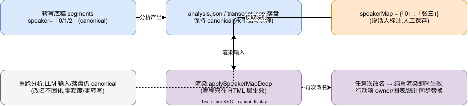

# MMBoard 用户操作手册(管理员)

| 项 | 值 |
|---|---|
| 版本 | v1.0 |
| 日期 | 2026-09-23 |
| 适用 | 系统管理员(唯一角色),浏览器访问 `http://10.20.30.203:8099/` |

## 1. 登录与账户

1. 打开地址,输入管理员账号口令。首次部署的口令在部署日志里(一次性),登录后立即在「设置 → 修改登录密码」改掉。
2. 会话过期自动回到登录页;「设置」里可随时改密。
3. 界面右上角可切换中文/英文。

## 2. 上传会议,生成纪要

1. 看板点「新建会议纪要任务」,拖入或选择文件:支持 mp3/wav/m4a/aac/mp4/mov/mkv,**单文件 ≤2GB**;
2. 任务创建后自动进入流水线:**抽音轨 → 转写 → AI 分析 → 生成纪要**;看板实时显示阶段进度;
3. 任务**串行执行**:前面有任务时显示"排队中",属正常;
4. 完成后任务行出现「纪要」按钮:在线查看或下载 HTML 文件;
5. 删除任务会**连带删除**源文件和纪要且不可恢复,重要纪要先下载。

**几种提示的正常含义**:

| 提示 | 含义 |
|---|---|
| 「服务器未装 ffmpeg,视频暂不可处理」 | 只能传纯音频 |
| 上传报「总存储配额已满」 | uploads 总量到 20GB 上限,删旧任务腾空间 |
| 上传报「文件中没有可用的音轨」 | 文件损坏或不是真实音视频 |
| 任务失败「队列已满」 | 等当前任务完成后再试 |

## 3. 说话人标注

1. 任务详情 → 说话人标注;
2. 给「说话人0/1/2…」填真实姓名,保存后纪要即时替换显示;
3. 改名可反复修改,不影响转写底稿;重跑分析后名字依然生效;
4. 行动项里的负责人若显示「说话人N」,会随标注自动换成真名。

## 4. 重跑

- **仅重跑分析**:转写结果不动,重新跑 AI 分析(不消耗转写额度)。AI 产出不理想时用这个;
- **整条重跑**:从源文件重新走全流程(需要源文件还在)。

## 5. 读懂纪要里的提示横幅

纪要顶部可能出现黄色横幅,含义与建议动作:

| 横幅 | 含义 | 建议 |
|---|---|---|
| 「转写/AI 分析为演示模拟数据」 | 当前处于演示模式,内容非真实会议 | 生产使用务必关闭演示模式 |
| 「AI 输出被截断或字段缺失,本纪要为部分结果」 | 模型输出不完整 | 重跑分析 |
| 「第 N 块提取失败,纪要可能缺失,建议重跑分析」 | 超长会议分块提取时有块失败,该段决议可能遗漏 | **重跑分析**;多次出现检查模型服务 |
| 「分析基于转写采样(非全文)」 | 极长转写未全文分析 | 重跑分析 |
| 「分析未生成章节:…」 | 模型没给出该章节 | 重跑分析;连续出现属模型能力问题 |

**行动项里的黄色警示**(逐条出现):

| 警示 | 含义 |
|---|---|
| 所附原文未在转写中核验到 | 引用原话在转写里找不到,可能是模型编造 |
| 所附原文未落在所附时间范围内 | 原话真实、但时间标错了段落 |
| 所附时间范围无法解析或起止颠倒 | 时间格式坏 |
| 所附时间范围未与转写对齐 | 时间范围超出音频或对不上任何段落 |

带警示的行动项**务必人工核对**后再执行;无警示的条目是经过系统核验的。

## 6. 设置

### 6.1 AI 分析模型(设置 → 模型管理)

- 添加模型:选协议(OpenAI 兼容 / Anthropic)、接口地址、模型名、API Key;多个条目用单选切换激活;
- 「测试」按钮验证连通;测试与实际调用走同一套安全通道;
- **内网/本机模型服务**:先在「内网模型白名单」里加一条主机(如 `127.0.0.1:11434`),否则地址会被拒绝;
- API Key 保存后打码显示;**改了接口地址必须重新输入 Key**;
- 另一窗口保存过设置时,本窗口保存会收到"已取消,请刷新"——刷新后重试即可。

### 6.2 转写通道(设置 → 转写通道)

- **讯飞云**:填 appId + apiSecret(apiKey 可选);消耗每日免费额度(默认 2 小时/天);
- **本地 FunASR**:填工作机地址(如 `http://10.10.10.144:8300`),免费;「保存并测试」验证在线;
- 切换只对**新上传**的任务生效;看板顶部显示当前通道。

### 6.3 修改登录密码

设置 → 修改登录密码,旧口令 + 新口令。

## 7. 转写通道怎么选

| 场景 | 建议 |
|---|---|
| 日常会议、追求准确率 | 讯飞云(注意额度) |
| 内部会议、量大且工作机在线 | 本地 FunASR(免费,不占额度) |
| 工作机离线 | 临时切回讯飞;离线期间提交的本地转写任务会明确失败,重传即可 |

## 8. 常见问题

| 问题 | 答案 |
|---|---|
| 任务一直排队 | 有任务在跑,系统一次处理一个;队列满(10 个)会拒绝新建 |
| 会话总过期 | 长时间无操作;重新登录即可 |
| 纪要里说话人显示「说话人2」 | 未标注,到详情里给这个编号填名字 |
| 想撤销删除 | 删除不可恢复;靠定期备份(联系维护者) |
| 忘记口令 | 联系维护者重置(需要生产主机权限) |
